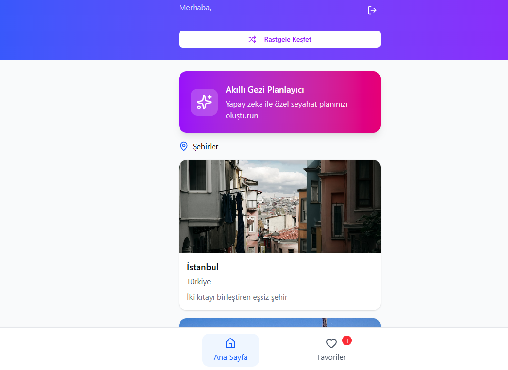
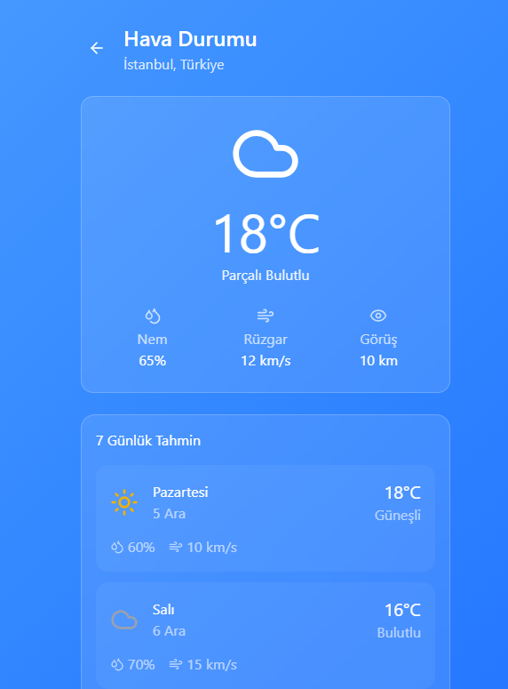
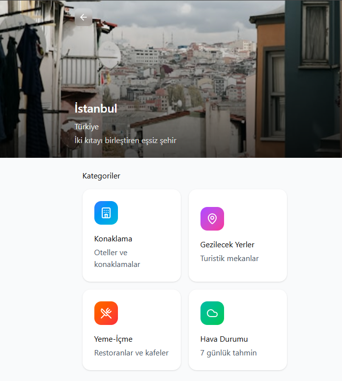

#  Akıllı Seyahat Asistanı
### Yapay Zekâ Destekli Mobil Şehir Rehberi ve Kişiselleştirilmiş Planlayıcı


Bu proje, seyahat planlama sürecindeki dağlıklığı ortadan kaldırmak ve kullanıcılara tek bir platform üzerinden akıllı, veriye dayalı ve kişiselleştirilmiş bir deneyim sunmak amacıyla geliştirilmiştir.

## 📖 Proje Hakkında
Günümüzde gezilecek yerler, konaklama, yeme-içme ve hava durumu gibi bilgilerin farklı platformlarda olması planlama sürecini zorlaştırmaktadır. Akıllı Seyahat Asistanı, bu verileri tek bir merkezde toplarken, **Google Gemini API** entegrasyonu ile kullanıcının kalacağı gün sayısına ve şehre göre saniyeler içinde saatlik rotalar oluşturur.

### ✨ Temel Özellikler
* **🤖 AI Rota Planlayıcı:** Google Gemini altyapısını kullanarak, gidilen şehre özel, mantıklı ve saat bazlı günlük gezi planları üretir.
* **🌤️ Dinamik Hava Durumu:** OpenWeatherMap API ile entegre çalışarak seyahat planlanan şehrin 7 günlük tahminlerini sunar.
* **📍 Kapsamlı Şehir Rehberi:** Konaklama, restoran ve popüler gezi noktalarını kategorize edilmiş şekilde listeler.
* **🎲 Keşfet Modu:** Kararsız kullanıcılar için rastgele şehir ve mekan önerileri sunan algoritma.
* **💾 Favoriler & Yerel Veri:** AsyncStorage kullanılarak kullanıcı tercihlerinin ve favori mekanlarının cihazda güvenli şekilde saklanması.


## 🛠️ Teknik Yığın (Tech Stack)
Uygulama, modern mobil geliştirme standartlarına uygun olarak modüler bir yapıda inşa edilmiştir:

- **Frontend:** React Native (Expo)
- **Navigasyon:** React Navigation (Stack & Tab)
- **Yapay Zekâ:** Google Gemini API (Generative AI)
- **Veri Kaynağı:** OpenWeatherMap API
- **State Yönetimi:** React Hooks (useState, useEffect)
- **Veri Depolama:** AsyncStorage (Local Storage)
- **HTTP İstemcisi:** Axios

## 📸 Uygulama Önizlemesi
| Ana Ekran | Hava Durumu Detay | AI Planlayıcı |Şehir Detay Ekranı |
| :---: | :---: | :---: | :---: |
|  |  |  |  |

## ⚙️ Kurulum ve Çalıştırma

Projeyi yerel ortamınızda çalıştırmak için şu adımları izleyin:

1. **Depoyu Klonlayın:**
   ```bash
   git clone [https://github.com/SelenayBulut/AkilliSeyahatAsistani.git](https://github.com/SelenayBulut/AkilliSeyahatAsistani.git)

2. **Bağımlılıkları Yükleyin:**
   ```bash
   cd Akilli_Seyahat_Asistani
   npm install
   
3. **API Anahtarlarını Ayarlayın:**
   Proje kök dizininde bir .env dosyası oluşturun ve anahtarlarınızı ekleyin:
   
   ```bash
   GEMINI_API_KEY=your_api_key_here
   WEATHER_API_KEY=your_api_key_here

4. **Uygulamayı Başlatın:**
   ```bash
   npx expo start
    
